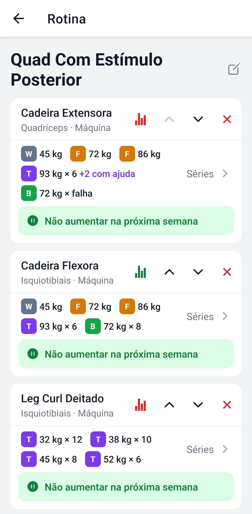
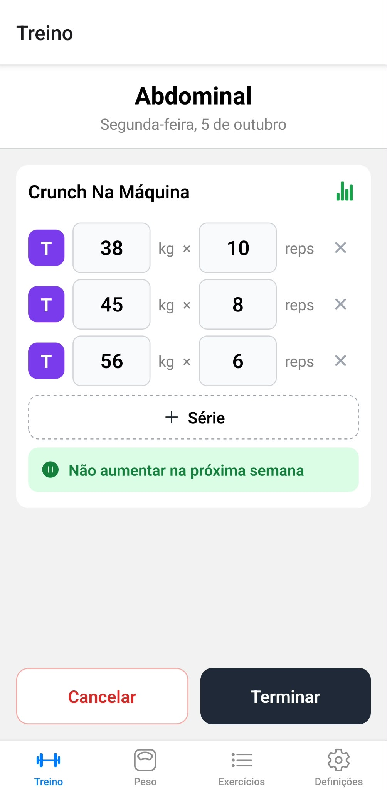
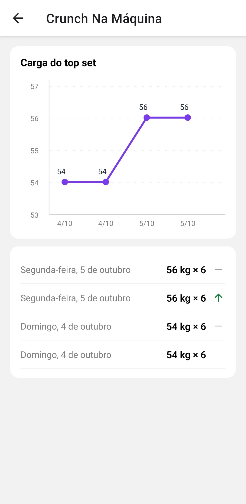
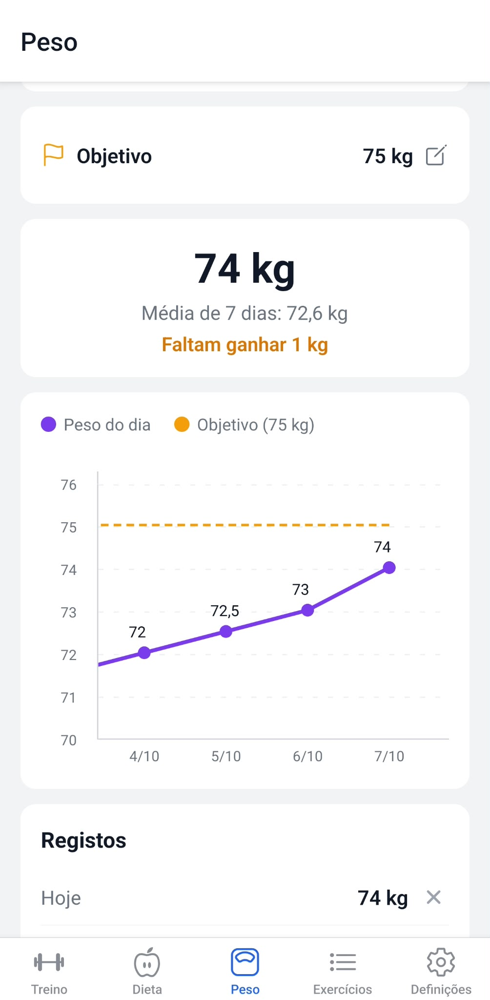
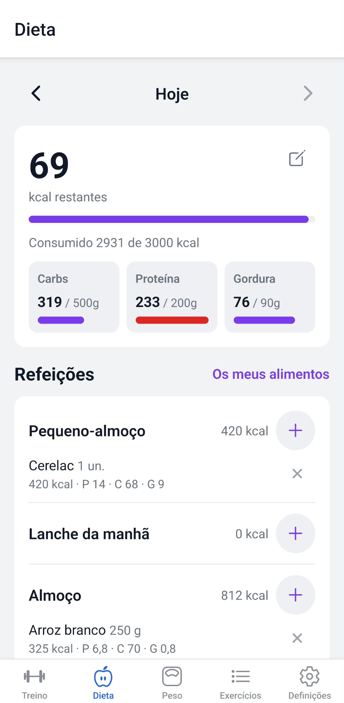
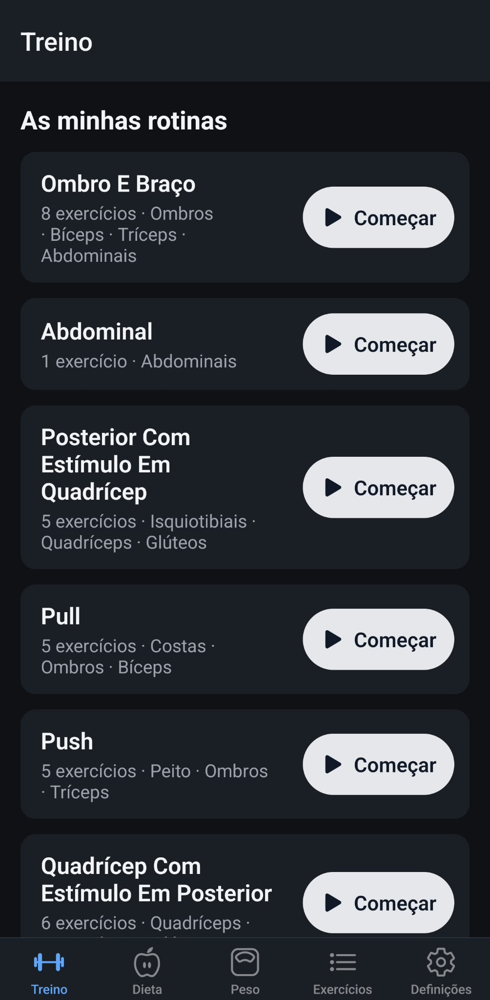
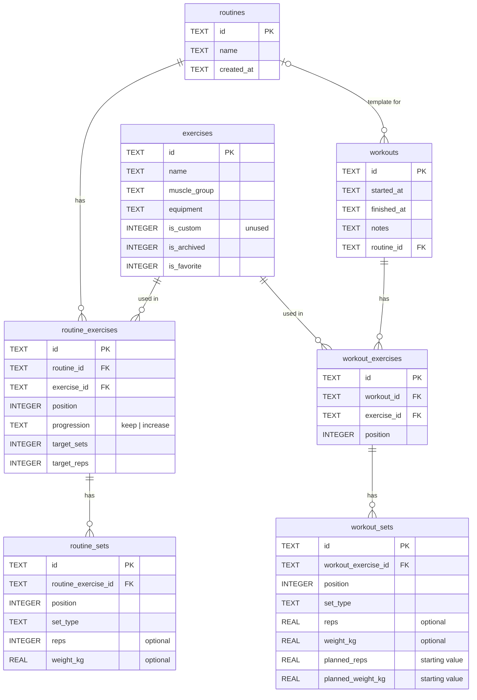
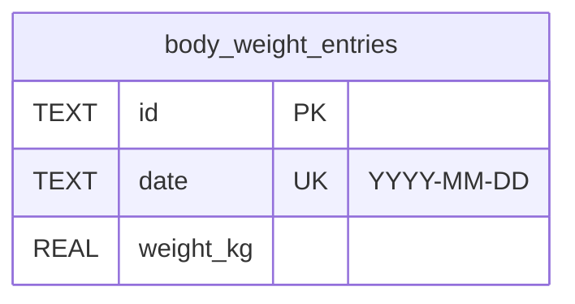
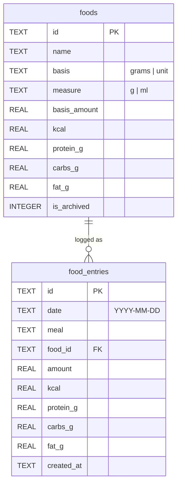

# 🏋️ GymLog
 


 
> 🚧 **This project is under active development.**
 
**GymLog** is a personal Android app to log gym workouts and body weight. It runs **fully offline**: there is no server and no login, and all data is stored locally on the phone with SQLite.
 
I'm building it for my own training: I wanted a simple, fast app that works even with no signal at the gym, keeps my full history and shows my progress, without ads or subscriptions.
 
## 📸 Screenshots
 
<p align="center">
  
  
  
</p>
<p align="center">
  
  
  
</p>

More screenshots in the [user guide](docs/user-guide.md).
 
## 🎯 Goals
 
- Log a full workout quickly, with or without internet
- See what was lifted last time for each exercise while training
- Track strength progress per exercise and detect personal records
- Log body weight daily and see the real trend in a chart
- Log what I eat and see the day's kcal, protein, carbs and fat against my goals
- Never lose data: easy export and import of backups
## 📋 Features
 
| Feature | Description |
|---------|-------------|
| Exercise library | My exercises grouped by muscle group, with search and filter |
| Manage exercises | Create, edit and archive my own exercises (the list starts empty) |
| Favorite exercises | Star exercises so they appear first in lists |
| Routines | One per weekly workout (e.g. Push, Pull, Legs): exercises in order and planned sets (W/F/T/B, weight, reps). The routine done most recently is listed first |
| Note for next week | Per exercise: green "keep the weight" or red "increase the weight" |
| Workout logging | Start from a routine, already filled with the last weights; edit weight and reps (half reps allowed), add or remove sets, add exercises (they are added to the routine too) |
| Exercise history | Icon on each exercise: popup with its progressions (green ▲) and regressions (red ▼), top set before → after |
| Workout summary | After finishing: exercises, sets, volume and progressions |
| Body weight log | One entry per day (today or past days); saving the same day again updates it |
| Body weight chart | Daily values and a line at the weight goal; the summary shows the 7-day average and how much is left to the goal |
| Backup | Export all data to a JSON file and import it back |
| Diet log | Day by day (‹ › to change day), 6 meals (Pequeno-almoço … Ceia): add foods by amount; kcal left and a bar per macro (red when over) |
| Diet goals | Daily kcal (required) and protein / carbs / fat (optional) |
| Food library | My own foods with kcal and macros per X grams, per X ml or per unit, with search; editing a food never changes days already logged |
| Dark mode | Settings → Aparência: automatic (follows the phone), light or dark |
| Exercise progress | Chart of the top set weight over time per exercise |
 
## 🛠️ Tech stack
 
| Purpose | Technology |
|---------|------------|
| Framework | React Native + Expo |
| Language | TypeScript (strict) |
| Navigation | Expo Router |
| Local database | expo-sqlite |
| IDs | expo-crypto (UUIDs) |
| Charts | react-native-gifted-charts |
| Backup files | expo-file-system, expo-sharing, expo-document-picker |
| Build | EAS Build (Android APK) |
| Testing | Jest |
 
## 🏗️ Project structure
 
```
GymLog/
├── src/
│   ├── app/                → screens (Expo Router)
│   │   ├── (tabs)/         → Workout, Diet, Body weight, Exercises, Settings
│   │   ├── exercise/       → exercise details, create/edit, progress chart
│   │   ├── diet/           → add food to a meal, my foods, goals
│   │   ├── routine/        → routine, rename, add exercises, planned sets
│   │   └── workout/        → workout summary
│   ├── components/         → reusable UI components
│   ├── hooks/              → screen logic (loading data, actions)
│   ├── db/
│   │   ├── schema.ts       → table definitions
│   │   ├── migrations.ts   → schema migrations (v1 to v11)
│   │   └── repositories/   → data access functions (one file per entity, + tests)
│   ├── lib/                → pure logic: search, labels, sets, progress, dates, body weight, backup (+ tests)
│   ├── theme/              → light and dark colours, theme provider
│   ├── test-utils/         → in-memory SQLite for repository tests
│   └── types/              → shared TypeScript types
├── assets/
├── app.json
├── eas.json
└── README.md
```
 
## 🗃️ Data model
 
| Table | Main fields |
|-------|-------------|
| exercises | id, name, muscle_group, equipment, is_custom (unused), is_archived, is_favorite |
| routines | id, name, created_at |
| routine_exercises | id, routine_id, exercise_id, position, progression (keep, increase or empty), target_sets (unused), target_reps (unused) |
| routine_sets | id, routine_exercise_id, position, set_type (warmup, feeder, top, backoff), reps (optional), weight_kg (optional) |
| workouts | id, started_at, finished_at, notes, routine_id (optional) |
| workout_exercises | id, workout_id, exercise_id, position |
| workout_sets | id, workout_exercise_id, position, set_type (warmup, feeder, top, backoff), reps (only top/backoff), weight_kg (empty until filled in), planned_reps and planned_weight_kg (values the set started with) |
| body_weight_entries | id, date (unique), weight_kg |
| app_settings | key, value (body weight goal, theme, diet goals) |
| foods | id, name, basis (grams or unit), measure (g or ml), basis_amount, kcal, protein_g, carbs_g, fat_g, is_archived |
| food_entries | id, date, meal, food_id, amount, kcal, protein_g, carbs_g, fat_g (stored when logged), created_at |
| diet_days | date, training_kcal (unused, kept so old migrations stay untouched) |

### Workouts and exercises



- `workouts.routine_id` is optional: a workout can be started without a routine.
- `workout_sets.set_type` and `routine_sets.set_type` are one of `warmup`, `feeder`, `top` or `backoff`.
- A routine stores, for each exercise, its planned sets: type plus optional reps and weight (e.g. W 15×40, F 3×70, T 6×100, B 8×85). Workouts started from it are pre-filled with these values; when a workout is finished, the values done are copied back into the routine (its structure does not change). Cancelling a workout changes nothing.
- Deleting a workout deletes its exercises and sets. An exercise already used in a workout cannot be deleted, only archived.

### Body weight

Independent from the workout tables: one entry per day.



### Diet

Foods are my own; each logged entry keeps a copy of the values worked out for the amount eaten.


 
## 🗺️ Roadmap
 
- [X] Phase 0: Project setup (Expo + TypeScript + Expo Router)
- [X] Phase 1: Database schema, migrations and seed of built-in exercises
- [X] Phase 2: Exercise library and custom exercises
- [X] Phase 3: Routines, workout logging, progress history and charts → **MVP**
- [X] Phase 4: Body weight log and chart → **MVP**
- [X] Phase 5: Backup export / import → **MVP**
- [X] Phase 6: First APK build installed on my phone
- [X] Extras: weight goal, dark mode, new icon, per-routine progress and diet tracking
## 📖 How to run (development)
 
```bash
npm install
npx expo start
```

Run the tests:

```bash
npm test
```
 
Open with a development build or Expo Go on the phone.
 
## 📦 Build and install on Android
 
```bash
npx eas-cli@latest login
npx eas-cli@latest build -p android --profile preview
```
 
The `preview` profile in `eas.json` is configured to generate an **APK**. Download it from the link at the end of the build and install it on the phone. Installing a new APK over the old one keeps the data.
 
## 💾 Backups
 
All data lives only on the phone. Use **Settings → Export backup** regularly and save the file to Google Drive or email. **Import backup** restores everything on a new phone or after reinstalling.
 
## 📘 User guide
 
New to the app? The **[user guide](docs/user-guide.md)** explains how everything works, step by step: exercises, routines, logging a workout, progress, body weight and backups.
 
## 📄 License
 
This project is licensed under the MIT License. See [LICENSE](LICENSE) for details.
