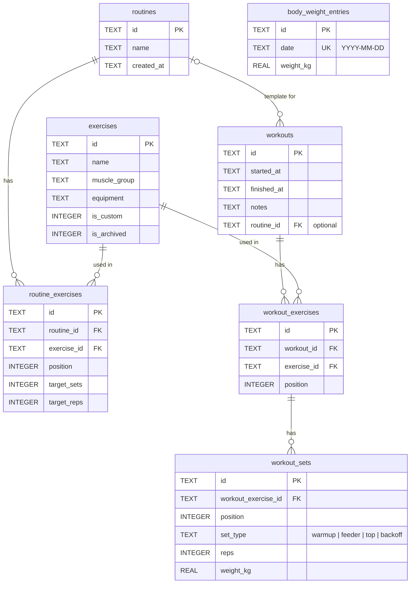

# 🏋️ GymLog
 


 
> 🚧 **This project is in its early planning stage.**
 
**GymLog** is a personal Android app to log gym workouts and body weight. It runs **fully offline**: there is no server and no login, and all data is stored locally on the phone with SQLite.
 
I'm building it for my own training: I wanted a simple, fast app that works even with no signal at the gym, keeps my full history and shows my progress, without ads or subscriptions.
 
## 📸 Screenshots
 
*Coming soon.*
 
## 🎯 Goals
 
- Log a full workout quickly, with or without internet
- See what was lifted last time for each exercise while training
- Track strength progress per exercise and detect personal records
- Log body weight daily and see the real trend in a chart
- Never lose data: easy export and import of backups
## 📋 Planned features
 
| Feature | Description | Priority |
|---------|-------------|----------|
| Exercise library | Built-in exercises grouped by muscle group | MVP |
| Custom exercises | Create, edit and archive my own exercises | MVP |
| Workout logging | Add exercises to a workout and record sets (reps + weight) | MVP |
| Workout history | List of past workouts with full details | MVP |
| Body weight log | One entry per day | MVP |
| Body weight chart | Daily values plus a 7-day moving average | MVP |
| Backup | Export all data to a JSON file and import it back | MVP |
| Previous performance | Show last session's sets while logging an exercise | High |
| Routines | Reusable workout templates (e.g. "Push day", "Legs") | High |
| Exercise progress | Chart of weight / estimated 1RM over time per exercise | High |
| Personal records | Automatic detection of new PRs | High |
| Rest timer | Countdown between sets | Nice to have |
| Statistics | Weekly volume, training frequency, muscle groups trained | Nice to have |
| CSV export | Export history to open in Excel | Nice to have |
| Dark mode | Light and dark themes | Nice to have |
 
## 🛠️ Tech stack
 
| Purpose | Technology |
|---------|------------|
| Framework | React Native + Expo |
| Language | TypeScript (strict) |
| Navigation | Expo Router |
| Local database | expo-sqlite |
| IDs | expo-crypto (UUIDs) |
| Charts | react-native-gifted-charts |
| Backup files | expo-file-system, expo-sharing, expo-document-picker |
| Build | EAS Build (Android APK) |
| Testing | Jest |
 
## 🏗️ Planned structure
 
```
GymLog/
├── src/
│   ├── app/                → screens (Expo Router)
│   │   ├── (tabs)/         → Workout, History, Body weight, Exercises, Settings
│   │   └── ...
│   ├── components/         → reusable UI components
│   ├── db/
│   │   ├── schema.ts       → table definitions
│   │   ├── migrations.ts   → schema migrations
│   │   ├── seed.ts         → built-in exercises
│   │   └── repositories/   → data access functions (one file per entity)
│   ├── lib/                → calculations (1RM, moving average, PRs), backup logic
│   └── types/              → shared TypeScript types
├── assets/
├── app.json
├── eas.json
└── README.md
```
 
## 🗃️ Data model
 
| Table | Main fields |
|-------|-------------|
| exercises | id, name, muscle_group, equipment, is_custom, is_archived |
| routines | id, name, created_at |
| routine_exercises | id, routine_id, exercise_id, position, target_sets, target_reps |
| workouts | id, started_at, finished_at, notes, routine_id (optional) |
| workout_exercises | id, workout_id, exercise_id, position |
| workout_sets | id, workout_exercise_id, position, set_type (warmup, feeder, top, backoff), reps, weight_kg |
| body_weight_entries | id, date (unique), weight_kg |



`body_weight_entries` is independent of the workout tables.
 
## 🗺️ Roadmap
 
- [X] Phase 0: Project setup (Expo + TypeScript + Expo Router)
- [ ] Phase 1: Database schema, migrations and seed of built-in exercises
- [ ] Phase 2: Exercise library and custom exercises
- [ ] Phase 3: Workout logging and history → **MVP**
- [ ] Phase 4: Body weight log and chart → **MVP**
- [ ] Phase 5: Backup export / import → **MVP**
- [ ] Phase 6: First APK build installed on my phone
- [ ] Phase 7: Routines and previous performance
- [ ] Phase 8: Progress charts and personal records
- [ ] Phase 9: Rest timer, statistics and polish
## 📖 How to run (development)
 
```bash
npm install
npx expo start
```
 
Open with a development build or Expo Go on the phone.
 
## 📦 Build and install on Android
 
```bash
npm install -g eas-cli
eas login
eas build -p android --profile preview
```
 
The `preview` profile in `eas.json` is configured to generate an **APK**. Download it from the link at the end of the build and install it on the phone. Installing a new APK over the old one keeps the data.
 
## 💾 Backups
 
All data lives only on the phone. Use **Settings → Export backup** regularly and save the file to Google Drive or email. **Import backup** restores everything on a new phone or after reinstalling.
 
## 📄 License
 
This project is licensed under the MIT License. See [LICENSE](LICENSE) for details.
