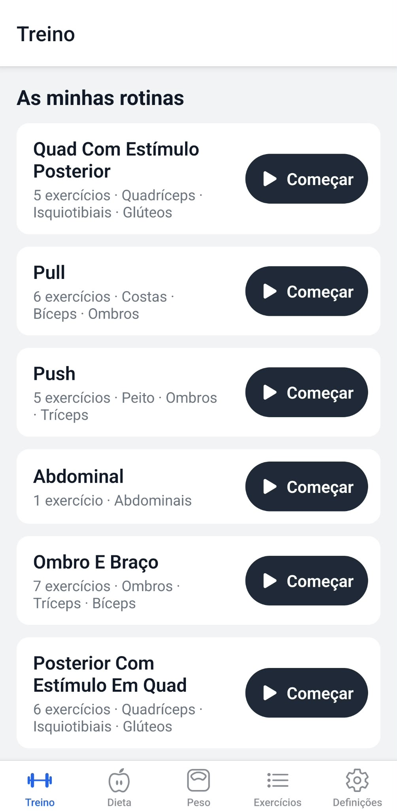
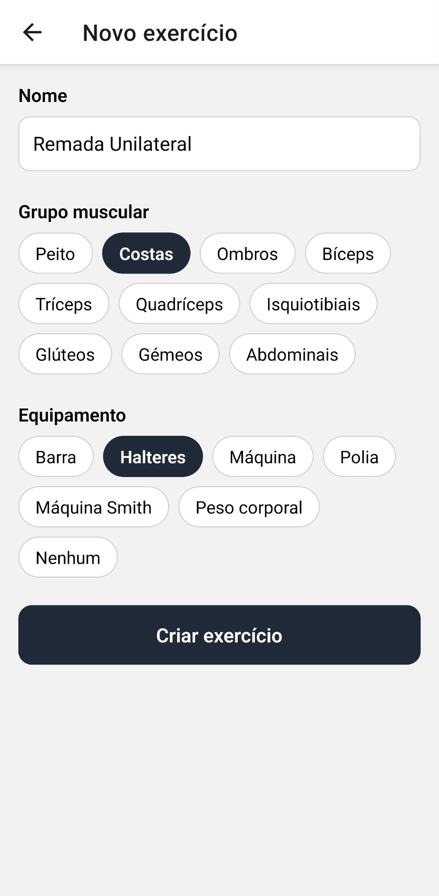
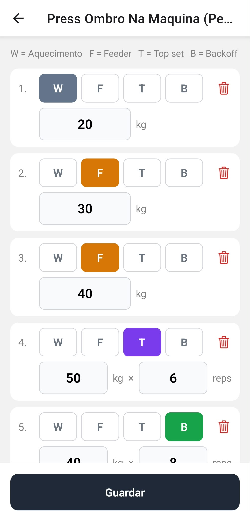
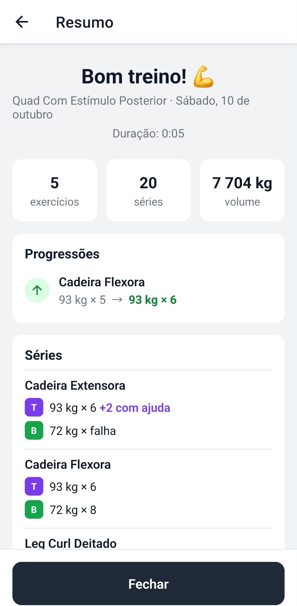
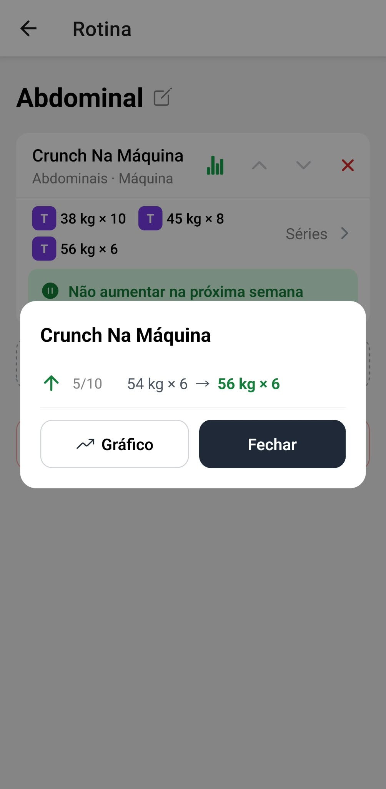
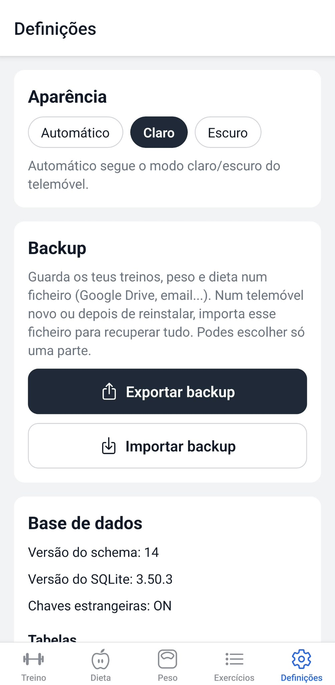

# 📘 GymLog user guide

This guide explains how to use GymLog, step by step. The app works **offline** and keeps everything on your phone.

The app is in Portuguese, so buttons and labels are written here **exactly as they appear on screen**, with the English meaning in parentheses.

[← Back to the README](../README.md)

## Contents

1. [The idea](#1-the-idea)
2. [First steps: create your exercises](#2-first-steps-create-your-exercises)
3. [Create your routines](#3-create-your-routines)
4. [Working out](#4-working-out)
5. [Tracking progress](#5-tracking-progress)
6. [Body weight](#6-body-weight)
7. [Backup: never lose your data](#7-backup-never-lose-your-data)
8. [Installing and updating the app](#8-installing-and-updating-the-app)
9. [FAQ](#9-faq)

---

## 1. The idea

GymLog is built around one simple idea: **your workouts are always the same, only the weights change**.

1. You create your exercises and your **routines** (e.g. Push, Pull, Legs) **once**, already with their sets and weights.
2. On workout day you tap **Começar** (Start) and the workout opens **already filled in** with last time's weights.
3. You change only what went up and tap **Terminar** (Finish). The new weights are saved into the routine for next time.

The app has 4 tabs at the bottom:

| Tab | What it is for |
|-----|----------------|
| 🏋️ **Treino** (Workout) | Your routines and the workout in progress |
| ⚖️ **Peso** (Weight) | Your body weight and its chart |
| 📋 **Exercícios** (Exercises) | Your exercise list |
| ⚙️ **Definições** (Settings) | Backup (export and import) |

---

## 2. First steps: create your exercises

The exercise list starts **empty**: you create the exercises you actually do.

1. Open the **Exercícios** (Exercises) tab.
2. Tap the round **+** button in the bottom-right corner.
3. Type the **Nome** (name), e.g. "Supino Plano com Barra", pick the **Grupo muscular** (muscle group) and, optionally, the **Equipamento** (equipment).
4. Tap **Criar exercício** (Create exercise).

**In the exercise list you can:**
- **Search** by name. Accents don't matter: "biceps" finds "Bíceps".
- **Filter** by muscle group with the buttons at the top.
- Tap the **⭐** to mark an exercise as a **favorite**. Favorites are listed first, also when you pick exercises for a routine.
- Tap an exercise to see its details, **Editar** (edit) it, **Ver progresso** (see progress) or **Apagar** (delete) it.

> ℹ️ If you delete an exercise you have already used in a workout, it is **archived** instead: it no longer shows in lists, but your history is kept.

---

## 3. Create your routines

A **routine** is a workout you repeat every week (e.g. "Push" = chest, shoulders and triceps).

### 3.1 Create the routine and pick its exercises

1. In the **Treino** (Workout) tab, tap **+ Nova rotina** (New routine) and give it a name (e.g. "Push").
2. Tap **+ Adicionar exercícios** (Add exercises).
3. Pick the exercises (you can pick several at once and filter by several muscle groups) and tap **Adicionar** (Add).
4. Use the **▲ ▼** arrows to put the exercises in the order you do them. The **✕** removes an exercise from the routine.

### 3.2 The sets of each exercise

Each exercise has a set structure. Each set has a type:

| Letter | Type | What it is for | Reps? |
|:------:|------|----------------|:-----:|
| **W** | Warm-up (*Aquecimento*) | Light weight, 12–15 reps | ❌ weight only |
| **F** | Feeder | Ramp-up sets, 2–3 reps | ❌ weight only |
| **T** | Top set | Your heaviest set: the one that measures your strength | ✅ weight × reps |
| **B** | Back-off | A lighter set after the top set | ✅ weight × reps |

Every new exercise starts with **W · F · F · T · B**. To change it:

1. In the routine, tap the row of coloured letters under an exercise (**Séries**, sets).
2. For each set, choose the **type** (W/F/T/B), type the **kg** and, for T and B, the **reps**.
3. **+ Adicionar série** (Add set) copies the last set (handy for a second top set). The 🗑 deletes a set.
4. Tap **Guardar** (Save).

> 💡 Use a **comma** for decimals: `102,5` kg. You can also log **half reps**: `4,5`.

---

## 4. Working out

### 4.1 Start

In the **Treino** (Workout) tab, tap **▶ Começar** (Start) on the day's routine. The routine you did most recently is always at the top of the list. The workout opens **already filled in** with the routine's weights, which are the ones from the last time you did it.

### 4.2 During the workout

- **Change the kg and reps** right in the fields. Everything is **saved automatically** as you type: if the app closes, nothing is lost.
- **Tap the letter** of a set (W/F/T/B) to change its type.
- **+ Série** (+ Set) adds a set equal to the last one; the **✕** deletes a set.
- You only need to change what is **different** from last time.
- Doing something extra today? Tap **+ Adicionar exercícios** (Add exercises) at the end of the workout. The exercises are also added to the routine, so they are there next time (remove them from the routine if it was a one-off).

### 4.3 The note for next week

At the bottom of each exercise there is a note to remind you what to do next time:

- 🟢 **"Não aumentar na próxima semana"** (don't increase next week): keep the weight.
- 🔴 **"Aumentar carga na próxima semana"** (increase the weight next week): time to go up.

Tap **+ Nota para a próxima semana** (note for next week), or the note itself, to set, change or remove it. The note is stored in the routine and shows up in the next workout.

### 4.4 Finish or cancel

- **Terminar** (Finish): the workout is saved and **the weights you did are copied into the routine**. A **Resumo** (summary) shows the number of exercises and sets, the total volume and your progressions.
- **Cancelar** (Cancel): the workout is deleted and **nothing changes** in the routine.

---

## 5. Tracking progress

### 5.1 The 📊 icon on each exercise

Next to each exercise name (in the routine and during the workout) there is an icon:

- 🟢 **Green**: the exercise already has progressions or regressions.
- 🔴 **Red**: it has none yet.

Tap it to see that exercise's history:

- ▲ **green**: you went up (e.g. `100 kg × 6 → 102,5 kg × 5`)
- ▼ **red**: you went down

The **Gráfico** (chart) button opens a chart of the top set weight over time.

### 5.2 How it is worked out

- Only the **top set** counts (the heaviest one, if you do two). Exercises without a top set use their heaviest set.
- **Progression**: more weight, **or** the same weight with more reps.
- **Regression**: less weight, or the same weight with fewer reps.
- The comparison is with the **last time** you did the exercise **in the same routine**. An exercise done in two routines (e.g. crunches at the end of Push, when you are more tired) has a separate history and chart in each. On the first workout of a routine, it is compared with the weights the workout started with.
- From an exercise's details (**Ver progresso**), buttons at the top choose which routine's chart to show.
- Workouts where **nothing changed** don't appear in the history.

---

## 6. Body weight

1. Open the **Peso** (Weight) tab.
2. Type your weight (e.g. `78,4`) and tap **Guardar** (Save). If you already logged today, the button says **Atualizar** (Update): there is only one entry per day.
3. Forgot a day? Use the **‹ ›** arrows to go to that day and log it.

Below you see:
- Your **latest weight**, the **average of the last 7 days** and how much that average changed in a week.
- The **chart**: the **purple** line is each day's weight and the dashed **orange** line is your **goal**.

**Goal**: tap **Objetivo** (Goal) to set your target weight (e.g. `75`). The summary then shows how much is left: *Faltam perder 3,4 kg* (3.4 kg left to lose) or *Faltam ganhar…* (… left to gain).

<!-- 📸 screenshot to add: images/10-peso.jpg (Weight tab with entries and the chart) -->

> 💡 Body weight changes a lot from day to day (water, food). Look at the **7-day average** in the summary: it shows the real trend. Weigh yourself at the same time each day, e.g. in the morning.

---

## 7. Backup: never lose your data

Your data lives **only on your phone**. If you uninstall the app or change phones without a backup, **you lose everything**. Back up regularly (e.g. once a week).

### Export

1. **Definições → Exportar backup** (Settings → Export backup).
2. The share menu opens: choose **Google Drive** (recommended) or send it by email.

The file is called `gymlog-backup-YYYY-MM-DD.json` and holds **everything**: exercises, routines, workouts and body weight.

### Import

1. **Definições → Importar backup** (Settings → Import backup).
2. Pick the file. The app shows what it contains (e.g. "27 exercícios, 6 rotinas, 20 treinos").
3. Tap **Importar** (Import).

> ⚠️ Importing **replaces everything** in the app with the backup's contents. If something fails halfway, nothing is changed.

---

### Appearance

**Definições → Aparência** (Settings → Appearance): **Automático** (follows the phone's light/dark mode), **Claro** (light) or **Escuro** (dark).

---

## 8. Installing and updating the app

- GymLog is installed from an **APK** file (it is not on the Play Store). When you open the APK, Android asks for permission to install apps from that source: allow it.
- **Updating**: install the new APK **over** the old one. Your data is kept.
- **Don't uninstall** the app without making a backup first.
- **New phone**: export a backup on the old phone, install the APK on the new one and import the backup.

---

## 9. FAQ

**I changed a weight during the workout and the routine didn't change.**
Weights are only copied into the routine when you tap **Terminar** (Finish). If you cancel, nothing changes.

**I did an extra top set one day. Is it added to the routine?**
No. The routine's structure (how many sets and of which type) only changes in the routine's set editor. A workout only updates the weights and reps.

**Why is the 📊 icon of an exercise red?**
That exercise hasn't gone up or down yet. It turns green the first time you change the top set's weight or reps and finish the workout.

**Can I use the app without internet?**
Yes, everything works offline. You only need internet to save the backup to Google Drive or send it by email.

**I deleted an exercise by mistake.**
If you never used it in a workout, it was deleted: create it again. If you had used it, it was archived and your history is kept.
